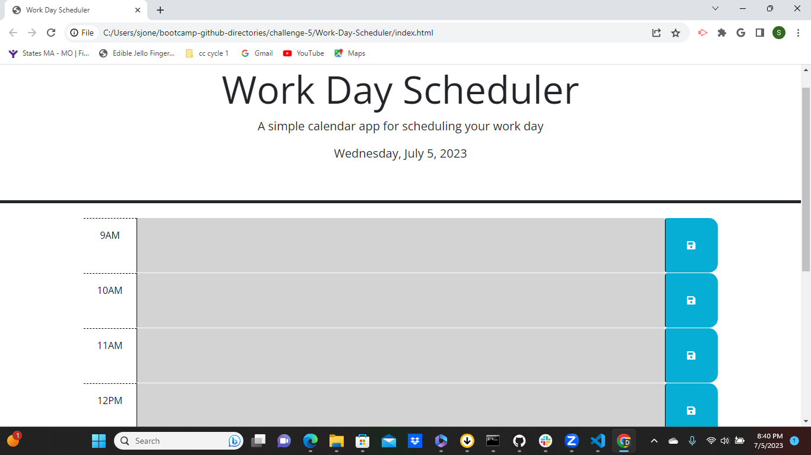
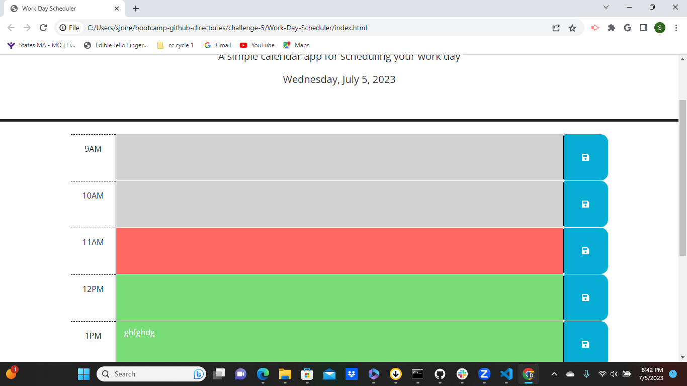
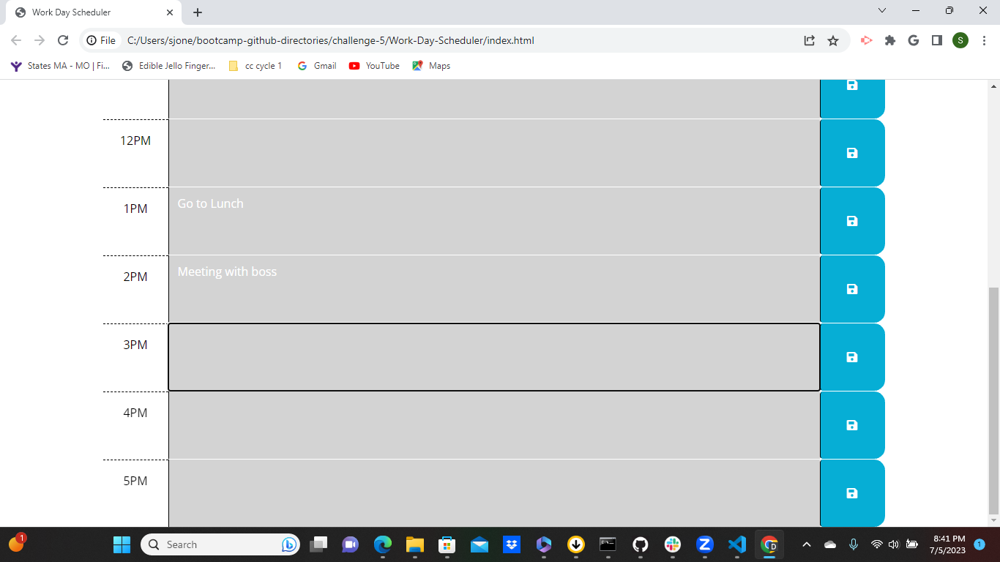

# Work-Day-Scheduler

## Description

This project was my first attempt at using day js. While this project was challenging, it seemed more doable than the two previous ones. I struggled the most with getting the info to render back to the screen from local storage. This code provides the user with a work day scheduler that changes colors showing the time (past, present, and future) and gives a space for the user to write their tasks for the day.    
  
## Usage

https://sjones-njones.github.io/Work-Day-Scheduler/

https://github.com/sjones-njones/Work-Day-Scheduler.git

## Credits

While I didn't work directly with anyone on this project, my cohort group helped answer many of my questions. I really enjoy the collaborative nature of this program.  I also received help from a tutor. I also used the following sites for help and suggestions.

https://developer.mozilla.org

https://www.w3schools.com

## License

Please refer to the LICENSE in the repo.
 
